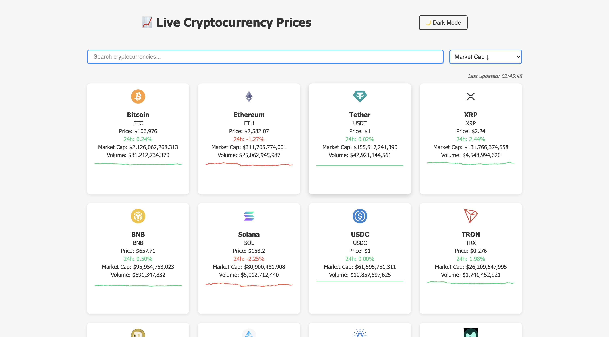
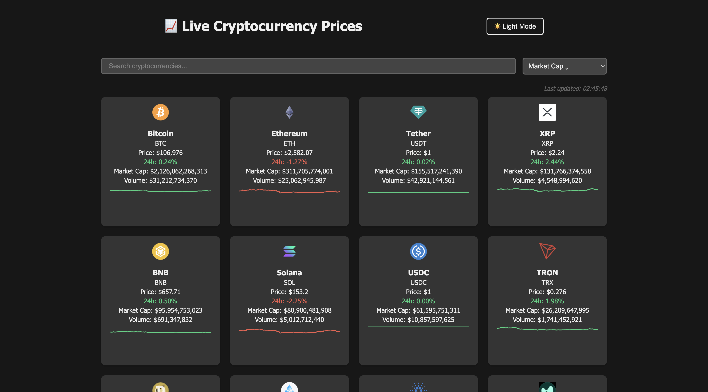
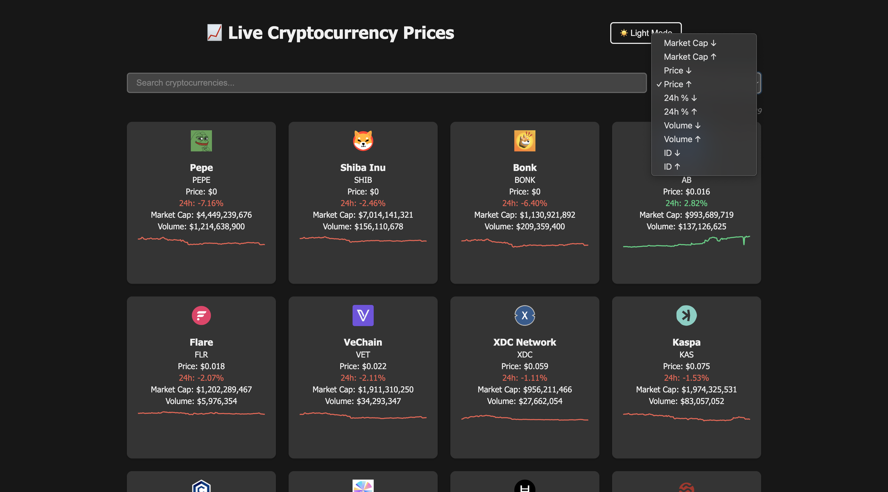
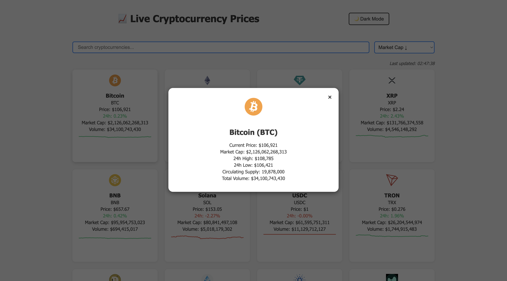

# 🪙 Crypto Tracker

A modern, responsive cryptocurrency price tracker built with **React** and powered by the [CoinGecko API](https://www.coingecko.com/en/api). View live market data, search and sort your  coins, and get detailed visual trends—all in one place.

## 🚀 Features

- 🔍 **Real-Time Search**: Instantly filter through 100 cryptocurrencies.
- 📊 **Live Market Data**: Auto-updates every 30 seconds via CoinGecko.
- 📈 **Inline Sparklines**: Trend visualization with Recharts.
- 📥 **Sorting Options**: Sort by price, market cap, volume, ID, and 24h % change (asc/desc).
- 🖱️ **Interactive UI**: Click a card to open detailed coin stats in a modal.
- 🎨 **Responsive Design**: Mobile-friendly layout with smooth UX.

## 🖼️ Preview

## 🖼️ Preview


<br/>

<br/>

<br/>



## 🛠️ Tech Stack

- **Frontend**: React (Functional Components + Hooks)
- **Charts**: Recharts
- **HTTP**: Axios
- **API**: [CoinGecko Markets Endpoint](https://api.coingecko.com/api/v3/coins/markets)

## 📦 Installation

1. Clone the repository:
   ```bash
   git clone https://github.com/Darsh244/crypto-tracker.git
   cd crypto-tracker
    ```
2. Install dependencies:
    ```bash
    npm install
    ```
3. Start the App locally:
    ```bash
    npm start
    ```
4. Open in your browser at:
    ```
    http://localhost:3000

    ```

## 🔧 Customization

1, You can modify the number of coins shown by editing:
```javascript
    params: {
              vs_currency: "usd",
              order: apiSort,
              per_page: 100, // modify this to change the number of coins shown
              page: 1,
              sparkline: true,
            }
```
2. You can modify the update interval by editing:
```javascript
intervalId = setInterval(fetchCoins, 30000); // 30000 -> update every 30 seconds
```


##  Future Improvements

- 💱 Currency selector (USD, EUR, BTC)
- ⭐ Favorite coins list
- 🌐 Deploy to Vercel or Netlify


Made with ❤️ by Darsh Mishra